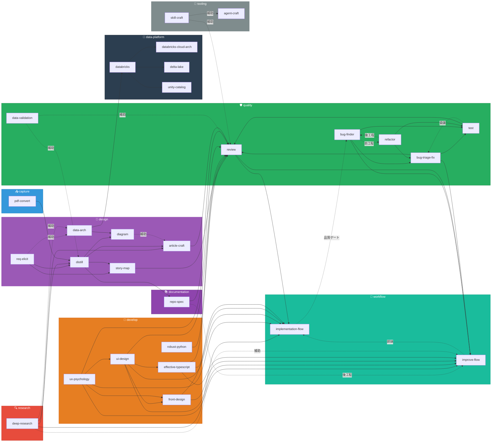

# 📂 Skills Index

> `.agent/skills/` に収録された全 27 スキルのカテゴリマップ。
> エンジニアリングワークフロー（Phase 0〜4）に沿った 8 カテゴリで整理しています。
>
> ※ 本リポジトリは [My-Agent-Skills](https://github.com/bogard7056/My-Agent-Skills)（29 スキル）から
> アジャイル開発に必要なスキルのみを抽出したサブセットです。

---

## カテゴリ俯瞰

---

## 📥 capture — 情報取り込み

顧客から受領した資料をテキスト化し、後続工程で分析可能な形にする。

| スキル | バージョン | 概要 | トリガー例 |
|:---|:---:|:---|:---|
| [pdf-convert](pdf-convert/SKILL.md) | v2.0.0 | PDF/DOCX/PPTX を Markdown に変換。Docling によるローカル処理、OCR 対応 | 「PDF を変換して」「inbox に取り込んで」 |

---

## � research — 調査・リサーチ

テーマに対して多段階の自律調査を行い、エビデンスベースの調査レポートを生成する。

| スキル | バージョン | 概要 | トリガー例 |
|:---|:---:|:---|:---|
| [deep-research](deep-research/SKILL.md) | v1.0.0 | Web 検索・文献探索を多段階に自律実行し、ChatGPT/Gemini Deep Research 相当の包括的調査レポートを生成。ソース信頼性評価・バイアス検出付き | 「Deep Research して」「徹底的に調査して」「市場調査して」 |

---

## �📐 design — 上流設計

要件の整理・構造化からアーキテクチャ設計、図面生成まで。

| スキル | バージョン | 概要 | トリガー例 |
|:---|:---:|:---|:---|
| [req-elicit](req-elicit/SKILL.md) | v1.0.0 | 曖昧な要求・要望から要件定義に必要な詳細を引き出す優先度別質問リストを生成。機能・非機能・データ・制約の 5 軸で網羅 | 「要件ヒアリングの質問を作って」「ざっくりした要求から質問リストを出して」「要望を要件にして」 |
| [distill](distill/SKILL.md) | v5.0.0 | ソース資料（inbox）→ 構造化仕様（notes）への蒸留。用語集・ドメインモデル・ビジネスルール策定 | 「inbox を notes に蒸留して」「ドメインモデルを作成して」 |
| [story-map](story-map/SKILL.md) | v2.0.0 | Jeff Patton 型ユーザーストーリーマッピング。ペルソナ抽出・フィーチャー洗い出し・リリース計画策定 | 「ストーリーマップを作成して」「MVP を定義して」「リリース計画を策定して」 |
| [diagram](diagram/SKILL.md) | v2.0.0 | draw.io 図面（.drawio）の自動生成。Azure/AWS クラウドアイコン対応 | 「アーキテクチャ図を描いて」「ER 図を作って」 |
| [data-arch](data-arch/SKILL.md) | v1.0.0 | 『Deciphering Data Architectures』に基づく 6 種アーキテクチャ比較評価・ADS 実施・データモデリング | 「データアーキテクチャを選定して」「DWH を設計して」 |
| [article-craft](article-craft/SKILL.md) | v1.0.0 | 記事全般（ブログ、解説、オピニオン、ケーススタディ等）の企画・構成・執筆・品質検証 | 「記事を書いて」「ブログを作成して」「コラムを書いて」 |
| [html-slide-gen](html-slide-gen/SKILL.md) | v1.0.0 | プレゼン用 HTML スライドを単一 HTML で生成。snippets/html/ui のコンポーネントを参照して Tailwind CDN で出力 | 「HTMLスライドを作って」「プレゼン用スライドを生成して」「html-slide-gen でスライドを」 |

---

## 📚 documentation — 仕様書生成・文書化

既存コードベースや成果物を解析し、保守・引き継ぎ可能な仕様書を体系的に生成する。

| スキル | バージョン | 概要 | トリガー例 |
|:---|:---:|:---|:---|
| [repo-spec](repo-spec/SKILL.md) | v1.0.0 | 既存リポジトリをリバースエンジニアリングし、システム概要・アーキテクチャ・API・データモデル・設定・デプロイメントの仕様書を生成 | 「このリポジトリの仕様書を作って」「コードから仕様を起こして」「レガシーコードの仕様を把握したい」 |

---

## 🔨 develop — 実装支援

書籍ベースのベストプラクティスを適用し、保守性の高いコードを書く。

| スキル | バージョン | 概要 | トリガー例 |
|:---|:---:|:---|:---|
| [effective-typescript](effective-typescript/SKILL.md) | v1.0.0 | 『Effective TypeScript 第 2 版』（83 項目）に基づく TS 設計・レビュー | 「TS のコードをレビューして」「any を減らしたい」 |
| [robust-python](robust-python/SKILL.md) | v1.0.0 | 『ロバスト Python』（24 章）に基づく型設計・クラス設計・拡張性改善 | 「Python のコードをレビューして」「型を設計して」 |
| [ui-design](ui-design/SKILL.md) | v1.1.0 | 『Refactoring UI』に基づく UI 設計・レビュー・改善。視覚的階層、カラー、タイポグラフィ | 「UI を改善して」「配色を決めて」 |
| [front-design](front-design/SKILL.md) | v1.1.0 | LP・ウェブサイトのフロントエンドデザイン戦略・アセット生成。カラー・タイポ・レイアウト・CSS・画像リソースガイド | 「LP を作りたい」「ウェブサイトのデザイン」「画像素材を探して」 |
| [ux-psychology](ux-psychology/SKILL.md) | v1.1.0 | 『Laws of UX』10 法則に基づく UX 心理学レビュー・設計。認知負荷・メンタルモデル・倫理デザイン | 「UX 心理学でレビューして」「認知負荷を減らしたい」 |

---

## 🛡️ quality — 品質保証

データ・テスト・成果物の品質を多角的に検証し、品質ゲートを通過させる。

| スキル | バージョン | 概要 | トリガー例 |
|:---|:---:|:---|:---|
| [data-validation](data-validation/SKILL.md) | v3.0.0 | テーブル構造・データ品質・スキーマ整合・ルール整合・数値整合の 5 種検証 | 「テーブルの整合性をチェックして」「CSV を検証して」 |
| [test](test/SKILL.md) | v1.0.0 | Khorikov の 4 本柱で価値の高い単体テストを設計・生成・レビュー | 「単体テストを書いて」「モックの使い方を見直して」 |
| [review](review/SKILL.md) | v6.0.0 | 成果物（ドキュメント・コード・設計書）のクリティカルレビュー（A-1〜A-4 / B-1〜B-6） | 「ドキュメントをレビューして」「要件カバレッジをチェックして」 |
| [bug-triage-fix](bug-triage-fix/SKILL.md) | v1.0.0 | エンドユーザーのバグ報告を受け取り、STAR 形式で構造化 → 仮説ツリーで原因特定 → 最小変更で修正 → 回帰テスト追加までの一貫したデバッグ支援 | 「バグを調査して」「ユーザーからバグ報告が来た」「エラーの原因を特定して」 |
| [bug-finder](bug-finder/SKILL.md) | v1.0.0 | バグ報告を待たず、指定リポジトリ・ディレクトリ・ファイルを能動スキャン。Null参照・競合状態・セキュリティ欠陥・ロジックエラーを検出し、重大度付き発見レポートを出力 | 「コードのバグを探して」「リポジトリを監査して」「脆弱性を探して」 |
| [refactor](refactor/SKILL.md) | v1.0.0 | コードスメル検出・技術的負債評価・Fowler パターン選定・段階的安全変更・動作検証まで一貫して実施。振る舞いを変えずに内部構造を改善 | 「リファクタリングして」「技術的負債を解消して」「DRY にして」「God Class を分割して」 |

---

## 🔷 data-platform — データプラットフォーム

Databricks を中心としたデータプラットフォームの設計・構築・最適化を支援。

| スキル | バージョン | 概要 | トリガー例 |
|:---|:---:|:---|:---|
| [databricks](databricks/SKILL.md) | v1.0.0 | Databricks プラットフォーム設計・構築（Workspace、コンピュート、Medallion Architecture、DLT/Lakeflow、MLflow、DBSQL、CI/CD） | 「Databricks の設計をして」「Medallion Architecture を設計して」 |
| [databricks-cloud-arch](databricks-cloud-arch/SKILL.md) | v1.0.0 | Databricks × AWS/Azure クラウドインフラアーキテクチャ（VPC/VNet、PrivateLink、IAM/Entra ID、Terraform、DR） | 「Databricks の VPC を設計して」「Databricks の Terraform を書いて」 |
| [delta-lake](delta-lake/SKILL.md) | v1.0.0 | Delta Lake テーブル設計・最適化・運用（Liquid Clustering、MERGE、Medallion、OPTIMIZE/VACUUM） | 「Delta Lake のテーブルを設計して」「MERGE のパフォーマンスを改善して」 |
| [unity-catalog](unity-catalog/SKILL.md) | v1.0.0 | Unity Catalog 設計・構築・移行（カタログ戦略、ABAC、Delta Sharing、Hive 移行、Terraform） | 「Unity Catalog を設計して」「Hive から UC に移行したい」 |

---

## 🔧 tooling — メタ・横断ツール

開発プロセス自体を改善するメタスキル。スキルやエージェントの設計・生成を支援。

| スキル | バージョン | 概要 | トリガー例 |
|:---|:---:|:---|:---|
| [agent-craft](agent-craft/SKILL.md) | v1.0.0 | Claude Code カスタムエージェント（.claude/agents/）の設計・生成 | 「カスタムエージェントを作って」「エージェントを設計して」 |
| [skill-craft](skill-craft/SKILL.md) | v1.0.0 | Agent Skills（.agent/skills/）の設計・生成・品質検証。SKILL.md + references/ の一貫した出力 | 「スキルを作成して」「新しいスキルを追加して」「skills を作って」 |

---

## 🚀 workflow — 統合ワークフロー

複数スキルを最適な順序で連鎖させ、エンドツーエンドの成果物を一気通貫で生成する。

| スキル | バージョン | 概要 | トリガー例 |
|:---|:---:|:---|:---|
| [implementation-flow](implementation-flow/SKILL.md) | v1.0.0 | 機能要求 → 調査 → UX設計 → アーキテクチャ → UI → TypeScript実装 → レビューの一気通貫ワークフロー（9スキル統合） | 「機能を実装して」「要件から実装まで一気にやって」「implementation-flow で作って」 |
| [improve-flow](improve-flow/SKILL.md) | v1.0.0 | 既存機能・見た目の改善要求 → 現状診断 → 課題優先付け → 改善設計 → 実装 → Before/After検証の一気通貫ワークフロー（10スキル統合） | 「このUIを改善して」「コードをリファクタリングして」「UXを洗練させたい」「improve-flow で改善して」 |

---

## Tier 分類

| Tier | スキル数 | 使用タイミング | スキル一覧 |
|:---|:---:|:---|:---|
| **Tier 1: コア** | 9 | 毎スプリント | distill, story-map, diagram, robust-python, effective-typescript, test, data-validation, review, refactor |
| **Tier 2: 設計・調査** | 8 | 案件タイプに応じて | pdf-convert, req-elicit, data-arch, ui-design, ux-psychology, front-design, article-craft, deep-research |
| **Tier 3: データ基盤** | 4 | データ基盤案件 | databricks, databricks-cloud-arch, delta-lake, unity-catalog |
| **Tier 4: ツーリング** | 2 | レトロスペクティブ改善 | agent-craft, skill-craft |
| **Tier 5: ワークフロー** | 2 | 機能開発・改善の一気通貫 | implementation-flow, improve-flow |
