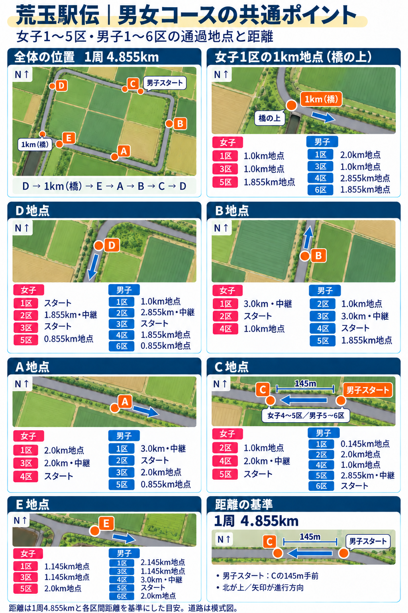

# 荒玉駅伝 男女コース共通ポイント図解

更新日: 2026-09-29。女子1〜5区・男子1〜6区が共有する6地点の図解。

- [Google Drive の画像](https://drive.google.com/file/d/1j9iRk5WAnNVdMyO_fDJX5MaMAVDrESzG/view?usp=drivesdk)
- [男女コース動画フォルダ](https://drive.google.com/drive/folders/1hR2ouziPiuo6wg7Z0WWJgDuieYakkd9k)
- ローカル画像: `input/aragyoku/course-points/aragyoku-course-common-points.png`
- 構造化距離対応: `input/aragyoku/course-points.json`

## 確定した地点情報

- 女子1区の1km地点は**橋の上**。見出しは「女子1区の1km地点（橋の上）」。
- 1周は**4.855km**。
- 男子1区スタートは**Cの145m手前**。北が上の図ではCの東側。男子1区がCを通過するときは0.145km地点。
- Dは北西の曲がり角から南へ進んだ直線上。全体図でも曲がり角の頂点や北側の道路に置かない。
- 進行順は **D → 1km（橋） → E → A → B → C → D**。
- 実際は中央線のない狭い道。画像内の「道幅は狭め・中央線なし」の説明行は削除済み。

上記はユーザー確認済みの情報。画像は道路形状を説明する模式図で、地図の正確な縮尺を保証するものではない。

## 男女各区の距離対応

| 共通地点 | 女子 | 男子 |
| --- | --- | --- |
| 女子1区の1km地点（橋の上） | 1区 1.0km地点／3区 1.0km地点／5区 1.855km地点 | 1区 2.0km地点／3区 1.0km地点／4区 2.855km地点／6区 1.855km地点 |
| D地点 | 1区 スタート／2区 1.855km・中継／3区 スタート／5区 0.855km地点 | 1区 1.0km地点／2区 2.855km・中継／3区 スタート／4区 1.855km地点／6区 0.855km地点 |
| B地点 | 1区 3.0km・中継／2区 スタート／4区 1.0km地点 | 2区 1.0km地点／3区 3.0km・中継／4区 スタート／5区 1.855km地点 |
| A地点 | 1区 2.0km地点／3区 2.0km・中継／4区 スタート | 1区 3.0km・中継／2区 スタート／3区 2.0km地点／5区 0.855km地点 |
| C地点 | 2区 1.0km地点／4区 2.0km・中継／5区 スタート | 1区 0.145km地点／2区 2.0km地点／4区 1.0km地点／5区 2.855km・中継／6区 スタート |
| E地点 | 1区 1.145km地点／3区 1.145km地点／5区 2.0km地点 | 1区 2.145km地点／3区 1.145km地点／4区 3.0km・中継／5区 スタート／6区 2.0km地点 |

距離は1周4.855kmと各区間距離を基準にした目安。区間の終点と次区間のスタートは同じ中継所。女子は5区までで、Cは女子4→5区・男子5→6区の中継所。

## 出典と作成方法

- 動画案内: `input/aragyoku/course-videos.md`
- 女子各区GPXと動画の距離・地点記号: `scripts/generate_aragyoku_women_course_videos.py`
- 男子1・3〜6区の動画用派生トラック: `scripts/build_aragyoku_men_gpx_from_women.py`（男子2区は実測GPX）。
- 動画: `web/public/videos/women-leg1.mp4`〜`women-leg5.mp4`、`men-leg1.mp4`〜`men-leg6.mp4`。
- 画像生成: built-in image_gen。橋の上・周回距離・男子スタート位置・道幅はユーザーの修正を反映。
- 生成プロンプト: `output/imagegen/aragyoku-course-common-points-final-prompt.txt`

旧女子専用図やGPS概算の旧版ではなく、この男女版をコース共通ポイントの参照画像として使う。
